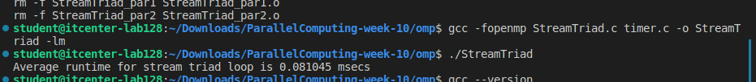
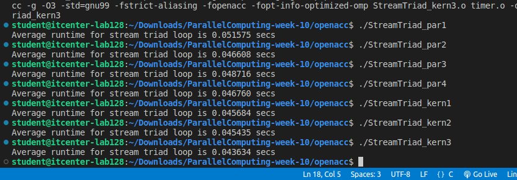
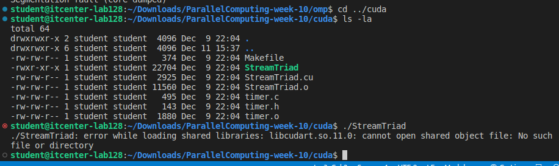
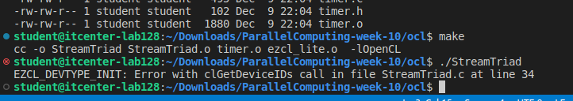

# ParallelComputing
1. OpenMP Results 
Time: 0.081 ms
OpenMP worked well. It uses all CPU cores to make the code run fast. This is the fastest version because it runs directly on the CPU without any special hardware needed.

2. OpenACC Results
Time: 43.634 ms
OpenACC ran but was very slow - 538 times slower than OpenMP! Probably because there's no GPU in this computer, so OpenACC just runs on the CPU but with extra steps that make it slower.

3. CUDA Results
Error: libcudart.so.11.0: cannot open shared object file
CUDA doesn't work at all. The computer doesn't have NVIDIA GPU drivers installed. CUDA only works on computers with NVIDIA graphics cards and special software.

4. OpenCL Results 
Error: No OpenCL devices found
OpenCL doesn't work. Needs a GPU with OpenCL drivers.

Conclusion
OpenMP is the most portable programming model for this benchmark. It works efficiently on any computer with multiple CPU cores. The GPU-based models (OpenACC, OpenCL, CUDA) all failed or performed poorly because this lab computer lacks the necessary GPU hardware and drivers.