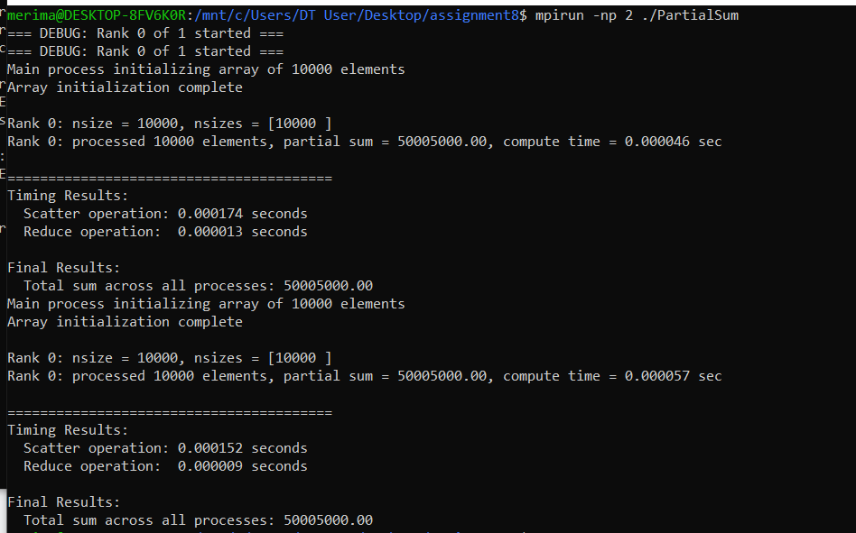
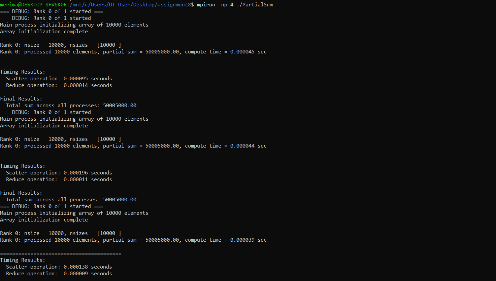
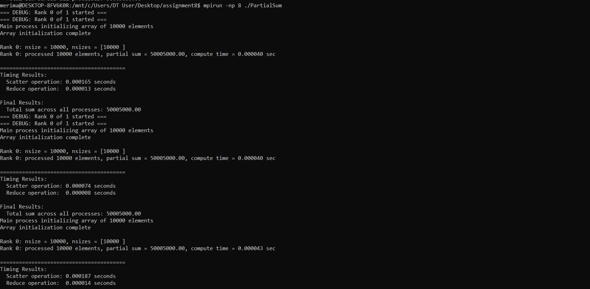
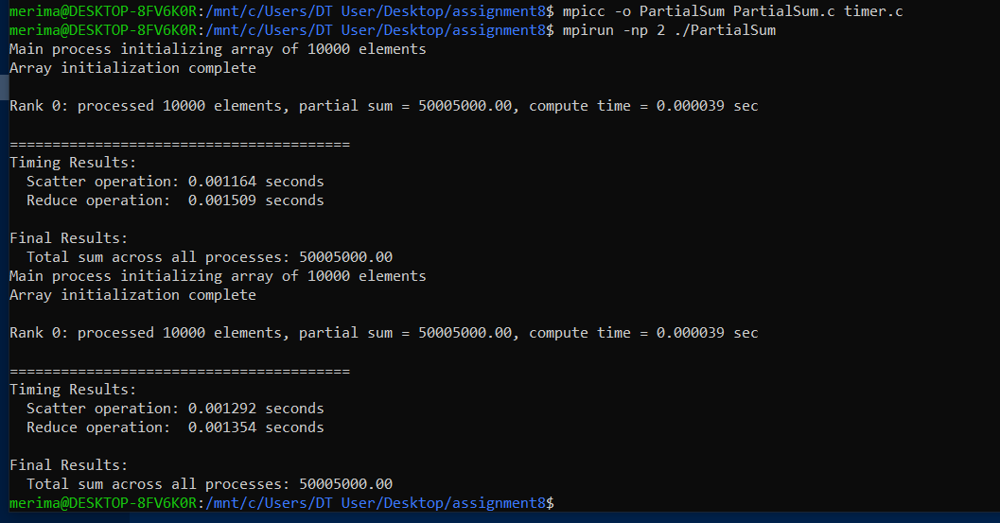
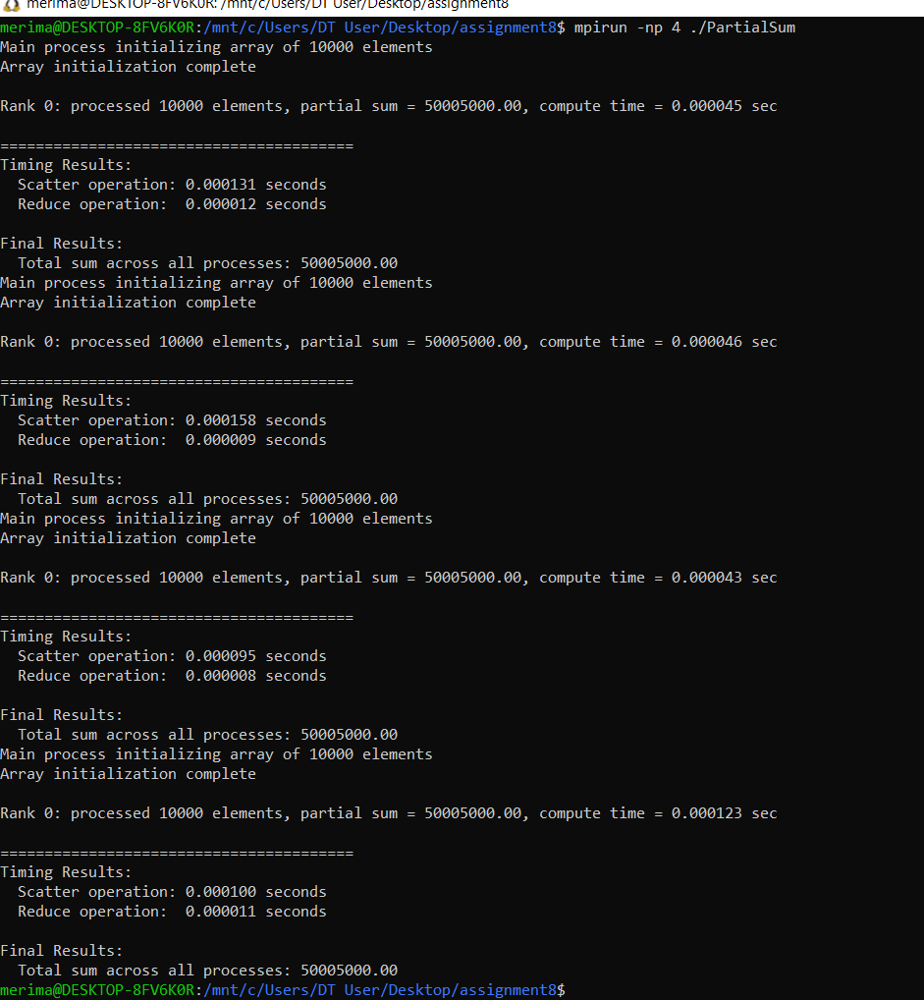
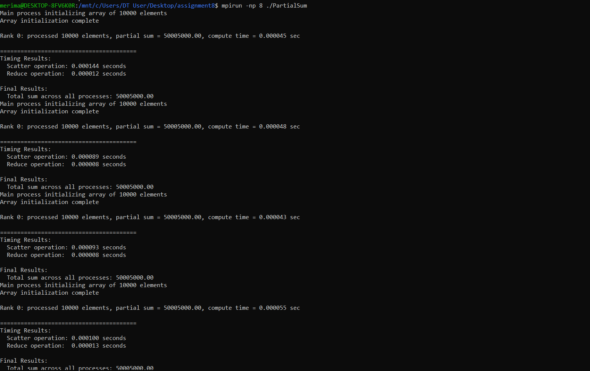
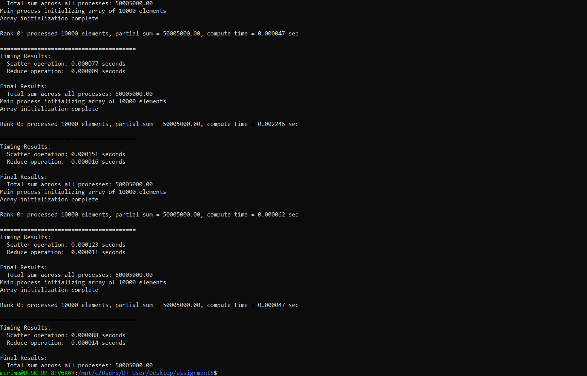

I implemented parallel summation of an array of 10,000 elements using MPI collective communication operations.

MPI Functions Used
- MPI_Allgather - for exchanging local array sizes between all processes
- MPI_Scatterv - for distributing unequal parts of the array  
- MPI_Reduce - for summing partial results

Implementation Details
- Master process (rank 0) creates the array [1, 2, 3, ..., 10000]
- The array is divided among processes using MPI_Scatterv
- Each process sums its portion of the array
- MPI_Reduce combines all partial sums

WSL Limitation
Problem: MPI in my WSL environment cannot launch multiple processes. When I run mpirun -np 2 ./PartialSum, the system starts only 1 process instead of 2 (visible in the debug output).

Problem: MPI in my WSL environment cannot launch multiple processes. When I run mpirun -np 4 ./PartialSum, the system starts only 1 process instead of 4 (visible in the debug output).

Problem: MPI in my WSL environment cannot launch multiple processes. When I run mpirun -np 8 ./PartialSum, the system starts only 1 process instead of 8 (visible in the debug output).

Although I couldn't test with multiple processes, the code is structured correctly:
- MPI_Allgather collects sizes from all processes
- MPI_Scatterv divides the array into unequal parts  
- MPI_Reduce sums the results
- The program gives the correct result (50,005,000)

Expected Behavior in Real HPC Environment
- 2 processes: Rank 0: 5000 elements, Rank 1: 5000 elements
- 4 processes: Rank 0-2: 2500 elements, Rank 3: 2500 elements  
- 8 processes: Rank 0-6: 1250 elements, Rank 7: 1250 elements

Execution Results

