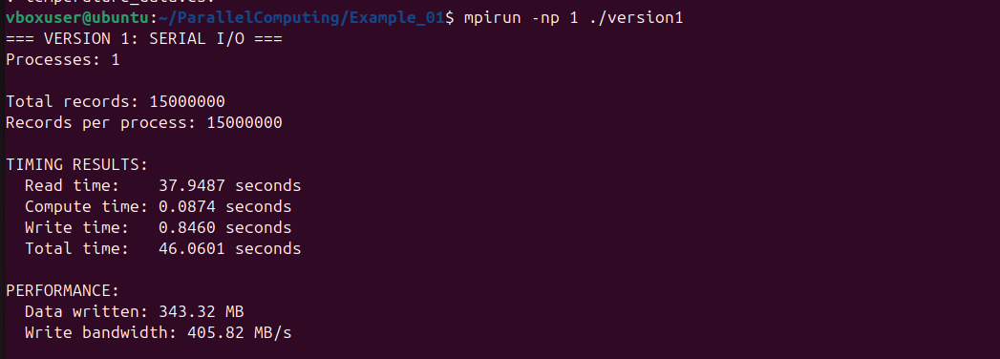
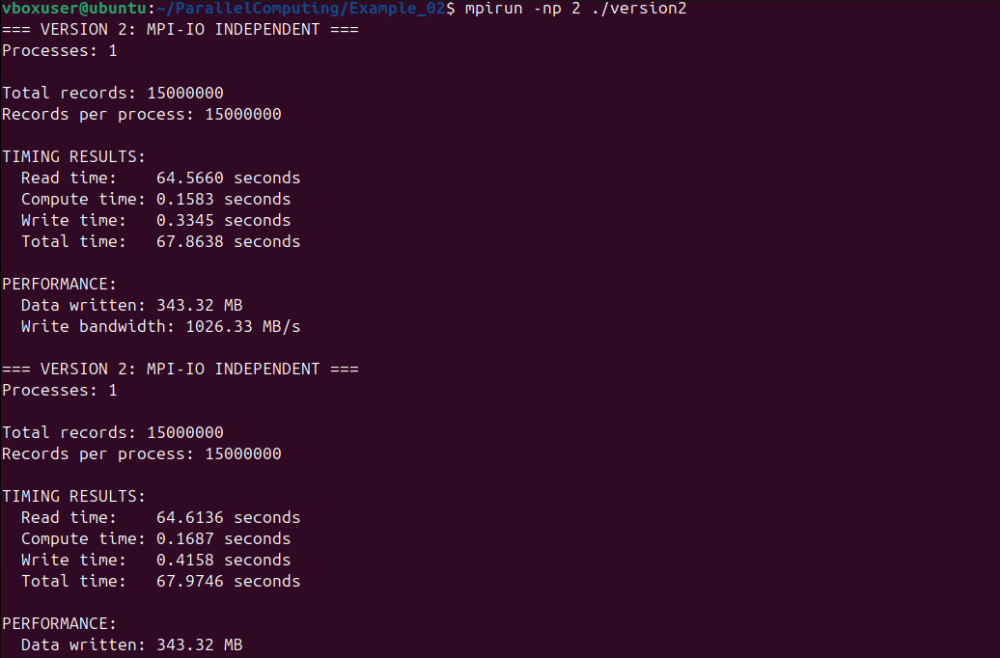
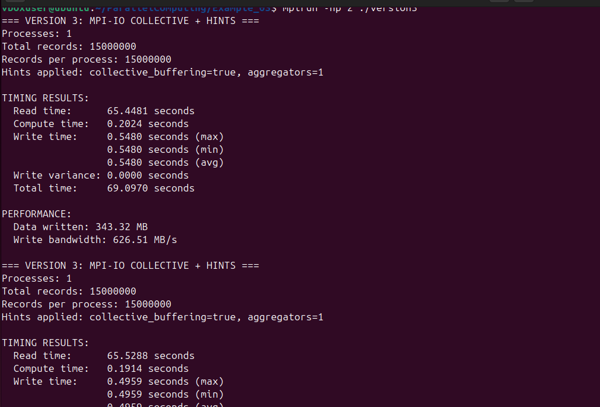
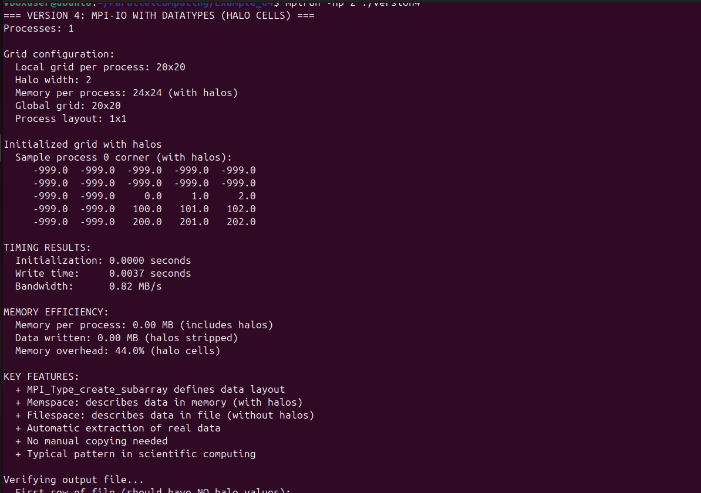
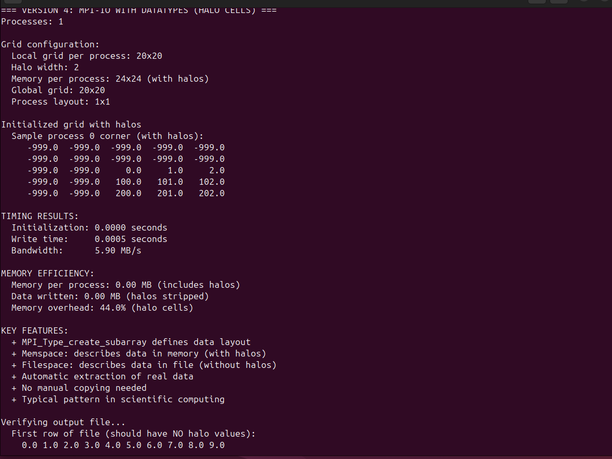

# ParallelComputing
This assignment tested four ways to process a large 1GB file on my dual-core processor. The first example was the fastest at 46 seconds because one core worked alone without any distractions. Since my processor is a dual-core model, the parallel versions were slower because both cores fought for the same disk at the same time.

Example_03 tried to help by using "hints" to organize the work, but it didn't speed things up on my small system. Given that I have a dual-core processor, the extra talking between only two processes took more time than the actual work. Finally, Example_04 showed that using smart data layouts can make the process nearly instant.

