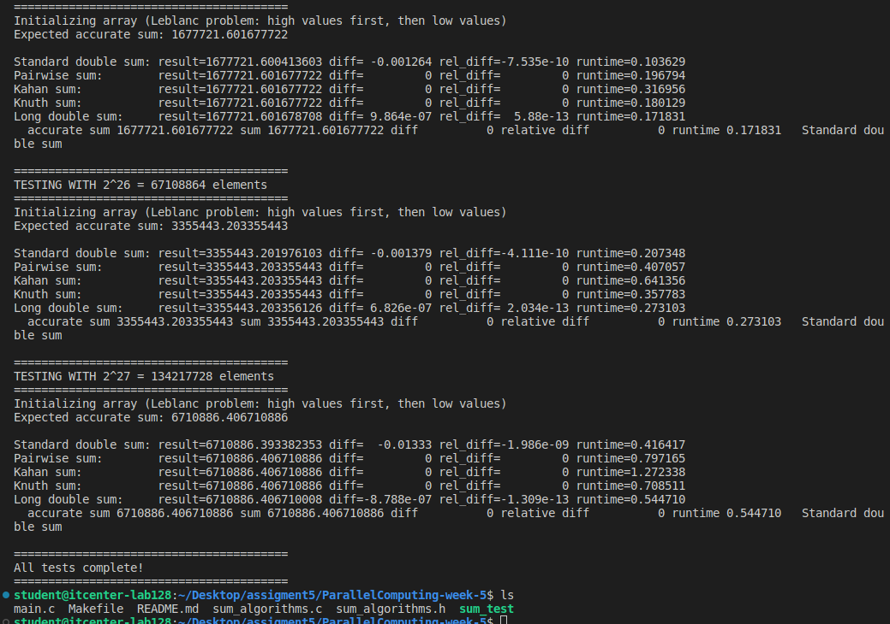
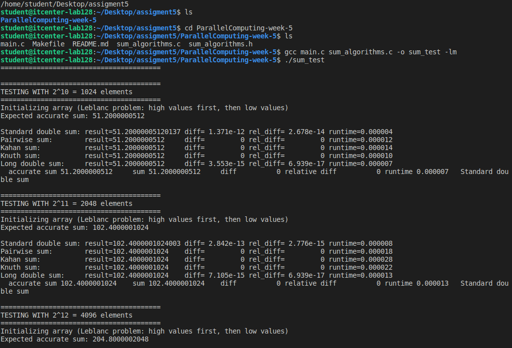

* Created a basic sum function `do_sum()` using standard double numbers.
* Made `main.c` 
* Filled arrays with high values first, then low values (Leblanc problem).
* Calculated the correct sum to compare with the results.
* Tested different sum methods:
  * Standard double sum
  * Pairwise sum
  * Kahan sum
  * Knuth sum
  * Long double sum
* Measured the result, error, and runtime for each method.
* Checked which methods give more accurate results and why some are better.

Sheet link:
https://docs.google.com/spreadsheets/d/1jdb_AbreLLfhETc2f5DzfoeygKGb5kSfAJ_4Y02NuDM/edit?usp=sharing

