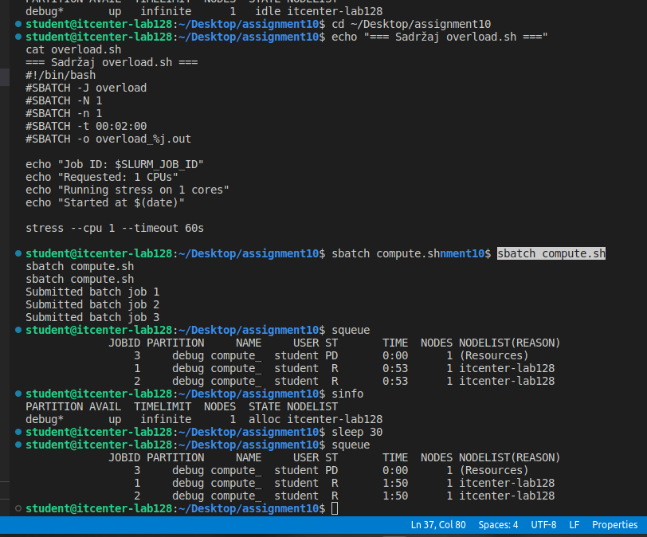
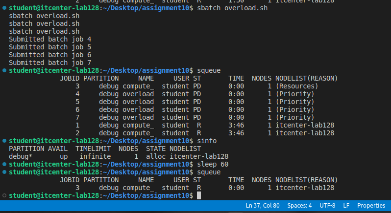
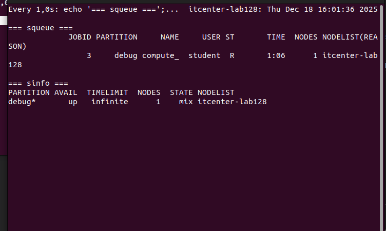
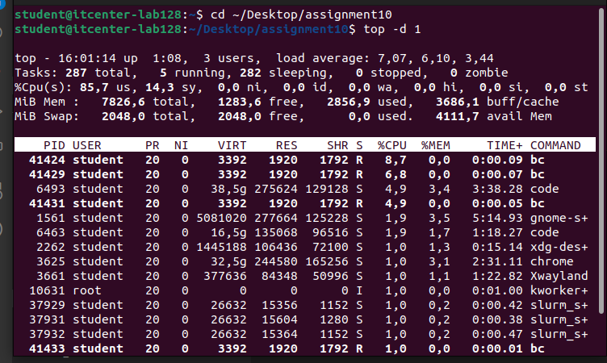

The machine has 4 CPUs (2 physical cores with hyperthreading) and 7.8 GB RAM. The slurm.conf file was properly configured with the correct hostname itcenter-lab128.

Testing compute.sh
The compute.sh script was submitted three times with sbatch. Each job requested 1 node and 1 CPU for 5 minutes. The squeue output showed jobs 1 and 2 running immediately while job 3 waited with status PD (Pending) and reason (Resources). 

Testing overload.sh
Submited 4 jobs with sbatch overload.sh. Each job wanted 1 CPU for 1 minute. All 4 went into queue (status PD). Only one could run at a time because the system has only 1 node. Slurm lined them up instead of letting all run together and crash the system.

