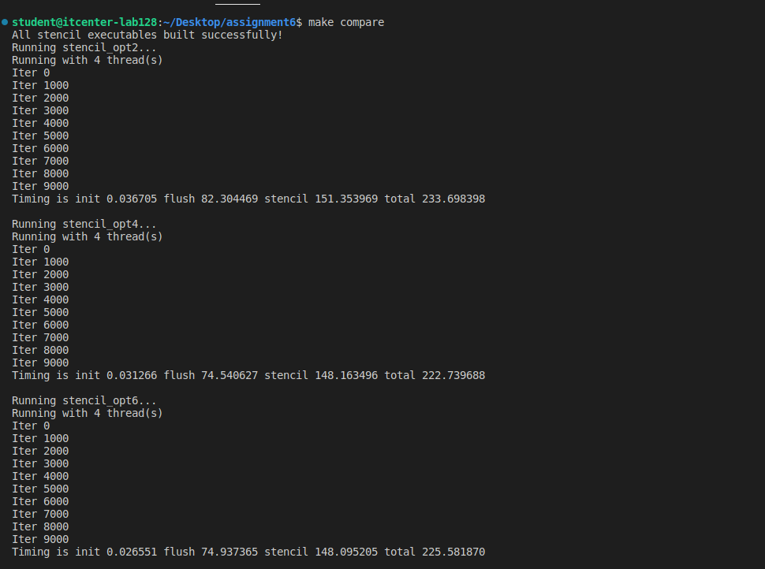

student@itcenter-lab128:~/Desktop/assignment6$ make compare
All stencil executables built successfully!
Running stencil_opt2...
Running with 4 thread(s)
Iter 0
Iter 1000
Iter 2000
Iter 3000
Iter 4000
Iter 5000
Iter 6000
Iter 7000
Iter 8000
Iter 9000
Timing is init 0.036705 flush 82.304469 stencil 151.353969 total 233.698398

Running stencil_opt4...
Running with 4 thread(s)
Iter 0
Iter 1000
Iter 2000
Iter 3000
Iter 4000
Iter 5000
Iter 6000
Iter 7000
Iter 8000
Iter 9000
Timing is init 0.031266 flush 74.540627 stencil 148.163496 total 222.739688

Running stencil_opt6...
Running with 4 thread(s)
Iter 0
Iter 1000
Iter 2000
Iter 3000
Iter 4000
Iter 5000
Iter 6000
Iter 7000
Iter 8000
Iter 9000
Timing is init 0.026551 flush 74.937365 stencil 148.095205 total 225.581870

This assignment demonstrates the use of OpenMP to parallelize a 2D stencil computation. Using OpenMP significantly improves performance compared to serial execution.
opt4 reduces unnecessary waits, speeding up execution slightly.
opt6 uses advanced strategies like manual work partitioning and explicit barriers to optimize memory access and minimize overhead.

1. How many threads your CPU used to execute the code? 
4 threads were used for all  programs

2. What are the parts of the code that were improved? What strategies were used to improve the code?
stencil_opt2.c-basic parallelization: `#pragma omp parallel for` for initialization and stencil loop
stencil_opt4.c-added `#pragma omp for nowait` for flush loop. opt4 reduces waiting by using nowait
stencil_opt6.c-High-level parallelism. Optimal data distribution and less synchronization.

3. What is the difference between explicit and implicit barriers inside the code and did they exist inside any of these examples? What do they actually mean? 
Implicit barrier: OpenMP automatically puts a “wait” at the end of a loop (#pragma omp for). All threads wait until everyone finishes before moving on.
Explicit barrier: You manually put #pragma omp barrier. All threads wait at that point until everyone reaches it.
In the examples:
opt2 and opt4 have implicit barriers.
opt6 uses explicit barriers.

